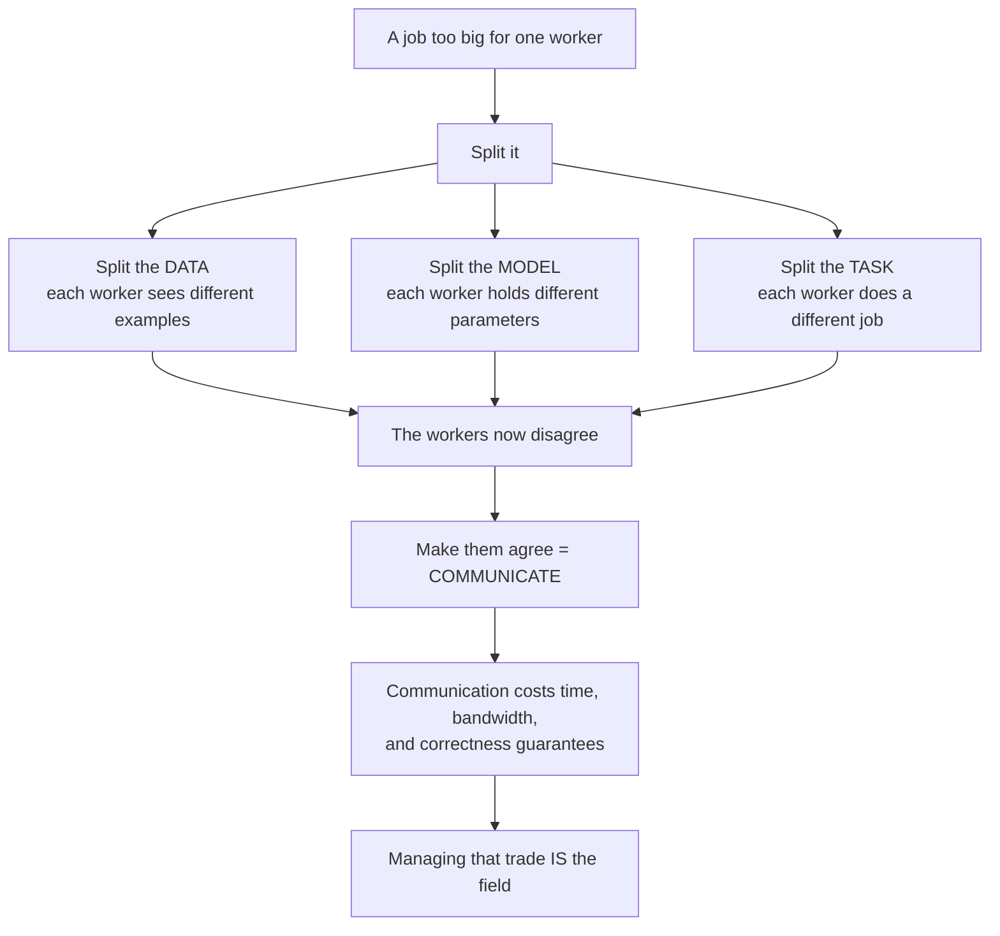
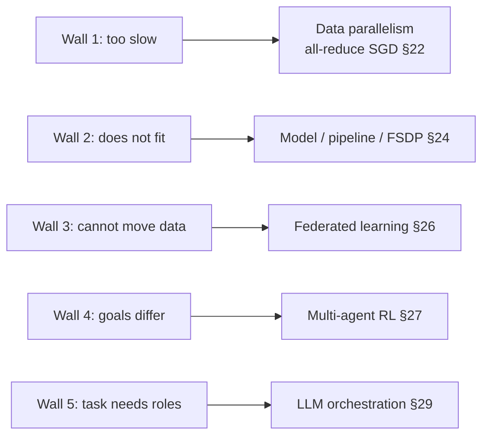

# 19. Why one machine is not enough: the three walls

[← 18. Revision priorities and self-testing](../06-interview-and-revision/18-revision-priorities-and-self-testing.md) | [↑ Table of contents](../../README.md) | [20. The cost of a message →](20-the-cost-of-a-message-alpha-beta-and-the-hierarchy.md)

---

> **Part VII opens the distributed-learning half of this guide.** Sections 1–18 asked how to build a reliable
> service out of unreliable machines. Sections 19–31 ask the narrower and harder question underneath it:
> **when many machines must agree on a single evolving value — a model, a plan, a decision — what does that
> agreement cost, and what do you lose if you weaken it?**

### The one sentence the whole part is about

**Splitting work is free. Re-agreeing is not.**

Every technique in Sections 19–31 — ring all-reduce, parameter servers, FSDP, gossip, FedAvg, MCP, A2A — is a
different answer to the same question: *how do I get N workers back into agreement without paying more for the
agreement than I saved by splitting?*



### Diagnose the wall before you pick the tool

People distribute for the wrong reason constantly. There are exactly three physical reasons to put a training
job on more than one machine, and each demands a *different* split. Getting this wrong is the single most
common architectural error in the area.

#### Wall 1 — Compute: it is too slow

Training time is FLOPs required divided by FLOPs per second available. For a dense transformer the standard
estimate is

```
FLOPs ≈ 6 · N_params · N_tokens
```

(forward is ≈2N per token, backward ≈4N.) A 7-billion-parameter model on 1 trillion tokens:

```
6 × 7e9 × 1e12 = 4.2e22 FLOPs
```

One accelerator sustaining ~4e14 effective FLOP/s needs 1.05e8 seconds — **about 3.3 years**. A thousand of
them at 50% scaling efficiency finishes in roughly **2.4 days**. *(Illustrative arithmetic, not a measurement:
the FLOPs coefficient and the efficiency factor are both assumptions.)*

→ The fix is **data parallelism** (§22): replicate the model, split the batch.

#### Wall 2 — Memory: it does not fit

Adam keeps, per parameter: weights, gradient, first moment, second moment. In fp32 that is **16 bytes per
parameter** before a single activation is stored. 7B parameters → **112 GB of optimizer state**. An 80 GB
accelerator cannot hold it at any batch size.

This is a *different* wall. Adding machines under data parallelism does not help, because data parallelism
*replicates* the thing that does not fit.

→ The fix is **sharding**: model, pipeline, tensor, or fully-sharded data parallelism (§24). ZeRO's framing of
this is explicit: data and model parallelism "exhibit fundamental limitations to fit these models into limited
device memory".[57]

#### Wall 3 — Data: it cannot be moved

Hospital records, phone keyboards, bank ledgers, and utility customer data are frequently *legally or
contractually immovable*. The computation must travel to the data rather than the reverse. FedAvg's original
motivation is exactly this: data that is "privacy sensitive, large in quantity, or both, which may preclude
logging to the data center".[51]

→ The fix is **federated learning** (§26).

### Two further walls that appear once workers stop being calculators

The three above are the classical ones. This guide adds two that only exist once a "worker" has its own
objective or its own judgement:

- **Wall 4 — divergent goals.** Workers optimise *their own* reward, not a shared loss. This is multi-agent RL,
  and it introduces non-stationarity, a problem that has no analogue in distributed SGD (§27).[64]
- **Wall 5 — the task needs roles.** The work is not one homogeneous computation but a heterogeneous workflow
  needing planning, specialisation, tools, and validation. This is LLM agent orchestration (§29).[74]



### Why this matters before any of the mechanics

Amdahl's law (§3) already told you that a serial fraction caps speed-up. The walls tell you something
stronger and more practical: **you cannot choose a parallelism strategy from a benchmark, only from a
diagnosis.** If you are memory-bound and you buy more data-parallel replicas, you have bought nothing. If you
are bandwidth-bound and you compress the wrong thing, you have bought nothing. Section 20 gives the cost model
that makes "bandwidth-bound" a measurable claim rather than a feeling.

### What to take from this section

1. Splitting is free; re-agreeing is the entire cost.
2. There are three physical walls — time, memory, data mobility — plus two that appear when workers have goals
   or roles.
3. Each wall has a *different* correct answer. Diagnose first.

---

[← 18. Revision priorities and self-testing](../06-interview-and-revision/18-revision-priorities-and-self-testing.md) | [↑ Table of contents](../../README.md) | [20. The cost of a message →](20-the-cost-of-a-message-alpha-beta-and-the-hierarchy.md)
