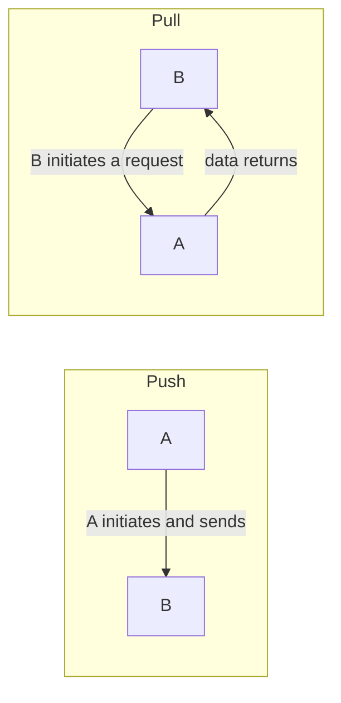
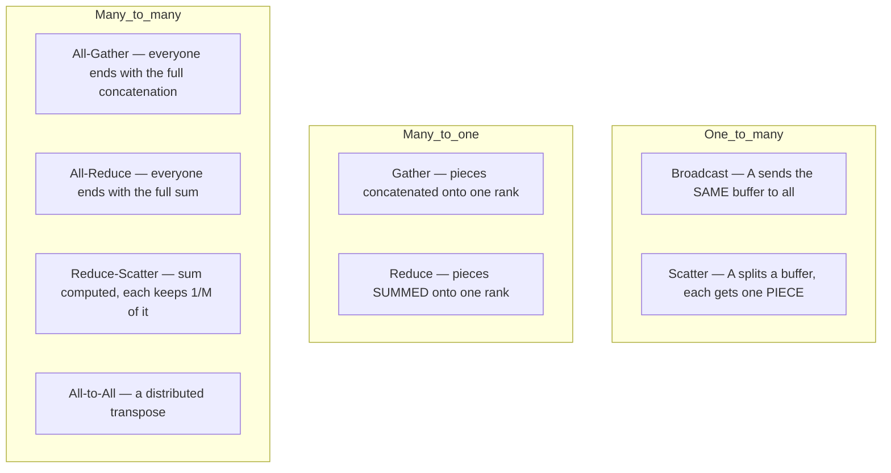
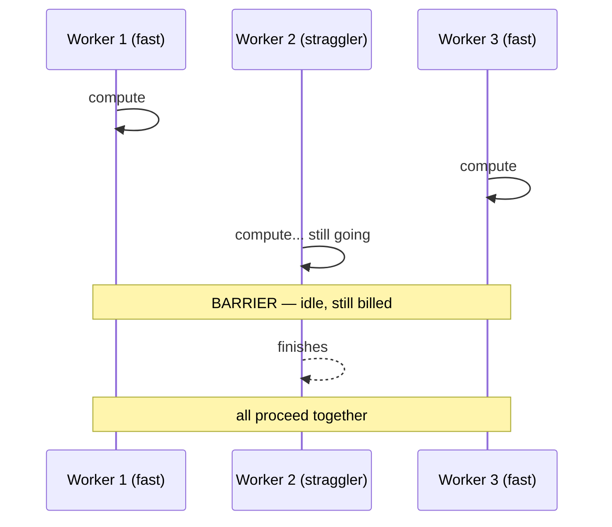

# 21. The primitives of distributed communication

[← 20. The cost of a message](20-the-cost-of-a-message-alpha-beta-and-the-hierarchy.md) | [↑ Table of contents](../../README.md) | [22. Data-parallel SGD →](22-data-parallel-sgd-and-ring-all-reduce.md)

---

Every distributed program is assembled from a small, fixed vocabulary. Learning it precisely is worth more
than learning any particular framework, because frameworks change and the primitives do not. The canonical
reference implementation is NVIDIA's NCCL, whose operation set is exactly the list below.[49]

### Point-to-point



Push and pull move identical bytes. The difference is **who decides when**, and that decides who may be idle,
who can be overwhelmed, and where backpressure lives (§4). In a parameter server (§23) workers *push*
gradients and the server *broadcasts* parameters — that asymmetry is the entire design, not an implementation
detail.

### Collectives



The clean way to hold this in memory is a 2×3 table on two independent axes — *what combines* and *where the
result lands*:

| | **Concatenate** (keep every byte) | **Reduce** (combine with +, min, max) |
|---|---|---|
| Result on **one** rank | Gather | Reduce |
| Result on **all** ranks | All-Gather | **All-Reduce** |
| Result **sharded** across ranks | (Scatter, from one source) | **Reduce-Scatter** |

### The identity that matters most

```
All-Reduce  =  Reduce-Scatter  +  All-Gather
```

NCCL states this explicitly: "Executing ReduceScatter, followed by AllGather, is equivalent to the AllReduce
operation."[49]

This is the most load-bearing equation in Part VII. It is *why* modern all-reduce achieves worker-count-
independent bandwidth (§22), and it is *why* fully-sharded data parallelism exists at all (§24) — FSDP is
precisely this decomposition with computation interleaved between the two halves.

### Synchronisation, and the tax it levies



**Wait** = one machine blocks on one signal. **Barrier** = every machine blocks until all arrive.

The cost of a barrier is set by the **slowest** participant, not the average:

```
T_step = max over m of T_m
```

If per-worker time has *any* variance, the expected maximum grows with the worker count. For M independent
workers with roughly Gaussian step times, `E[max] ≈ μ + σ·sqrt(2·ln M)`. **Synchronisation converts variance
into latency.** This is the same tail-latency phenomenon as §4 and "The Tail at Scale"[6], now applied to
training rather than serving, and it is the direct motivation for asynchronous training (§23).

### Overlapping computation and communication

The single most valuable engineering principle in the area: **a worker waiting on the network is a worker you
are paying for and not using.** The idle gap is called a **stall**.

```mermaid
gantt
    dateFormat X
    axisFormat %s
    title Serial versus overlapped execution
    section Serial
    compute          :0, 10
    communicate      :10, 6
    compute          :16, 10
    section Overlapped
    compute L1-L3    :0, 4
    compute L4-L6    :4, 3
    compute L7-L9    :7, 3
    comm grads L7-L9 :done, 4, 3
    comm grads L4-L6 :done, 7, 3
```



Concretely in backpropagation: gradients for the **last** layer are ready **first**. So you launch the
all-reduce for layer L's gradient while still computing layer L−1's. By the time backprop ends, most of the
communication has already happened. PyTorch DDP implements exactly this, grouping gradients into "allreduce
buckets" so that "allreduce hooks fire in-between sections of backwards, and schedule communications to
overlap with compute".[72]

The idealised result:

```
T_serial  = T_compute + T_communicate
T_overlap = max(T_compute, T_communicate)
```

Communication can be hidden **entirely** while `T_comm ≤ T_comp`. Once communication exceeds computation, no
scheduling saves you — you must send fewer bytes (§23) or restructure the parallelism (§24). This is a hard
boundary, and knowing which side of it you are on is the practical payoff of §20.

### What to take from this section

1. The vocabulary is small and stable: push/pull, broadcast, scatter, gather, all-gather, reduce, all-reduce,
   reduce-scatter, all-to-all, wait, barrier.
2. Classify collectives on two axes: concatenate-vs-reduce, and one-vs-all-vs-sharded.
3. `All-Reduce = Reduce-Scatter + All-Gather` — memorise this one.
4. A barrier costs the maximum, not the mean; synchronisation turns variance into latency.
5. Overlap communication with computation, or accept a stall.

---

[← 20. The cost of a message](20-the-cost-of-a-message-alpha-beta-and-the-hierarchy.md) | [↑ Table of contents](../../README.md) | [22. Data-parallel SGD →](22-data-parallel-sgd-and-ring-all-reduce.md)
