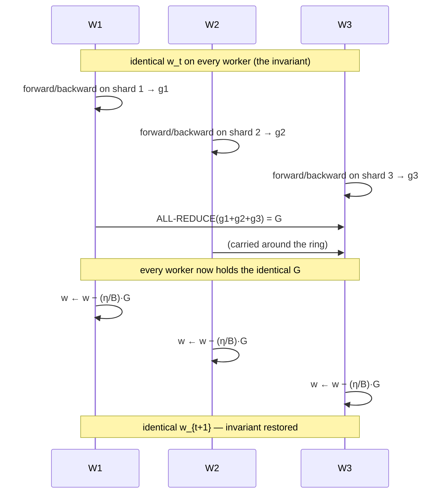
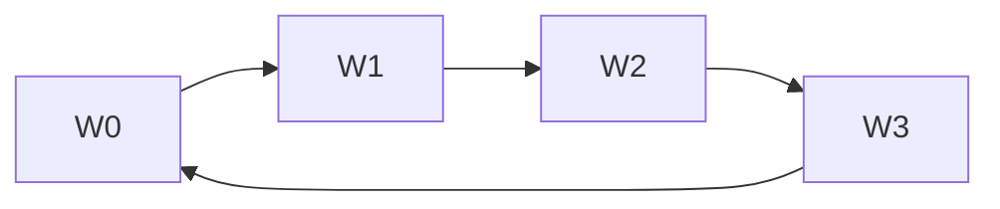

# 22. Data-parallel SGD and ring all-reduce

[← 21. The primitives](21-the-primitives-of-distributed-communication.md) | [↑ Table of contents](../../README.md) | [23. The parameter server →](23-the-parameter-server-and-the-meaning-of-time.md)

---

This section does two things: proves that distributed data-parallel SGD is *not an approximation*, and derives
why ring all-reduce scales when the obvious implementation does not.

## Part A — The algorithm

Minibatch SGD on one machine:

```
w_{t+1} = w_t − (η/B) · Σ_{i=1..B} ∇ℓ(w_t; x_i)
```

Split the batch across M workers, B/M examples each. Worker m computes its partial sum, then a **sum
all-reduce** combines them.



## Part B — Proof of statistical equivalence

**Claim.** For all t and all workers m, m′: `w_t^(m) = w_t^(m′) = w_t^seq`.

*Base case.* At t = 0 every worker is initialised from the same seed, or one worker broadcasts its
initialisation. The parameters are identical. ✓

*Inductive step.* Assume all `w_t^(m)` are equal. Then every worker evaluates gradients **at the same point**,
so the all-reduced sum is

```
G = Σ_m g_m = Σ_{i=1..B} ∇ℓ(w_t; x_i)
```

which is exactly the sequential minibatch gradient over the full batch B. All-reduce delivers **the same G to
every worker** — that is its definition[49]. Each applies the same update with the same η, so all `w_{t+1}^(m)`
are equal, and equal to sequential SGD's `w_{t+1}`. ∎

**Why this matters more than it first appears.** Distributed data-parallel SGD is not "close to" SGD; it *is*
SGD, executed faster. Consequently your hyperparameters, your convergence theory, and your intuition all
transfer unchanged. Because momentum and Adam are deterministic functions of the gradient sequence, the
argument extends to them immediately.

This is a rare and valuable property. Almost every other technique in Part VII — asynchrony (§23), gossip
(§25), FedAvg (§26) — **gives this property up** and must then argue separately about convergence. Knowing
exactly what you are surrendering, and why, is the point.

## Part C — Why the naive all-reduce fails

Send every worker's N-byte gradient to a root, sum, broadcast back. The root receives `(M−1)·N` bytes through
**one** network interface:

```
T_naive ≈ 2(M−1)·N·β
```

**Linear in M.** This is dead by a few dozen workers, and it is a *hardware* bottleneck at the root, not an
algorithmic one — no amount of code tuning removes it.

## Part D — Ring all-reduce, derived

Arrange the M workers in a logical ring. Split each gradient into M chunks of N/M bytes.



**Phase 1 — Reduce-Scatter, M−1 steps.** In each step every worker sends one chunk to its right neighbour and
adds the chunk arriving from its left. After M−1 steps, worker m holds the **fully summed** chunk m.

**Phase 2 — All-Gather, M−1 steps.** Each worker passes its completed chunk around the ring. After M−1 steps
everyone holds every chunk.

Note that this is literally the identity from §21 — reduce-scatter then all-gather.[49]

**Cost:**

```
T_ring = 2(M−1)·α          ← latency term
       + 2·((M−1)/M)·N·β   ← bandwidth term
       + ((M−1)/M)·N·γ     ← arithmetic term
```

**Now take the limit:**

```
lim (M→∞) of 2·((M−1)/M)·N·β  =  2·N·β
```

> **The bandwidth cost of ring all-reduce is independent of the number of workers.**

Every worker sends about 2N bytes in total whether M is 8 or 8000. This is **bandwidth-optimal**: `2·((M−1)/M)·N·β`
is a lower bound for any all-reduce algorithm, since each worker must at minimum send its own data out once and
receive the result once.

**The price** is the latency term `2(M−1)·α`, which is **linear in M**. So, using §20's regimes:

- **Large gradients** → bandwidth term dominates → ring is near-optimal.
- **Small gradients or very many nodes** → latency term dominates → use a **tree** or hierarchical algorithm
  with `O(log M)` latency instead.

Production libraries select the algorithm per message size and topology. That selection logic *is* §20's
two-regime rule implemented in C.

## Part E — The wall data parallelism eventually hits

Data parallelism scales by **growing the effective batch**: `B_eff = M · b_local`. That is not free.

The variance of the gradient estimate falls as `σ²/B`, so doubling the batch reduces gradient *noise* only by
√2 — diminishing returns in information per unit of compute. To keep per-step progress you scale the learning
rate with the batch (the linear scaling rule, with warm-up, as used to train ImageNet in one hour[62]). But η
is capped by curvature: SGD diverges once η exceeds roughly 2/L for an L-smooth objective.

The consequence is a **critical batch size** beyond which steps-to-convergence stops falling while FLOPs per
step keep rising. McCandlish et al. quantify this with the gradient noise scale and observe that the limit of
"massive data parallelism seem[s] to differ from domain to domain, ranging from batches of tens of thousands in
ImageNet to batches of millions in RL agents".[53]

```mermaid
flowchart LR
    A["Add more data-parallel workers"] --> B["Effective batch grows"]
    B --> CB below the critical batch size?
    C -->|Yes| D["Near-linear speed-up"]
    C -->|No| E["Steps stop falling,<br/>FLOPs keep rising"]
    E --> F["Switch strategy:<br/>model / pipeline / FSDP §24"]
```

The second drawback, named directly in the CS4787 treatment, is that **workers are idle during the all-reduce
unless you overlap** (§21).[75] Both drawbacks push toward the parameter server (§23) and toward sharding
(§24).

## Part F — Where do the examples come from?

Two options, with a real trade-off:[75]

| | **Training-data servers** | **Partitioned local storage** |
|---|---|---|
| Random access to the full dataset | Yes — true global shuffle | No — local shuffle only |
| Network load per epoch | High (pull every batch) | Zero |
| Elastic worker count | Easy | Hard (requires re-sharding) |
| Fault recovery | Easy | A lost shard is lost data |

Shuffle quality is not cosmetic: SGD's convergence argument assumes i.i.d. sampling, and local-only shuffling
correlates consecutive gradients. **This is the seed of the non-IID problem that dominates federated learning**
(§26) — the same defect, made unavoidable.

### What to take from this section

1. Data-parallel SGD with all-reduce is *provably identical* to sequential minibatch SGD — hyperparameters and
   theory transfer.
2. Naive all-reduce is `O(M)` and bottlenecks at the root; ring all-reduce has **worker-count-independent
   bandwidth** and `O(M)` latency.
3. Choose ring for big payloads, tree for small ones — §20's regimes again.
4. Data parallelism dies at the critical batch size, not at a hardware limit.

---

[← 21. The primitives](21-the-primitives-of-distributed-communication.md) | [↑ Table of contents](../../README.md) | [23. The parameter server →](23-the-parameter-server-and-the-meaning-of-time.md)
