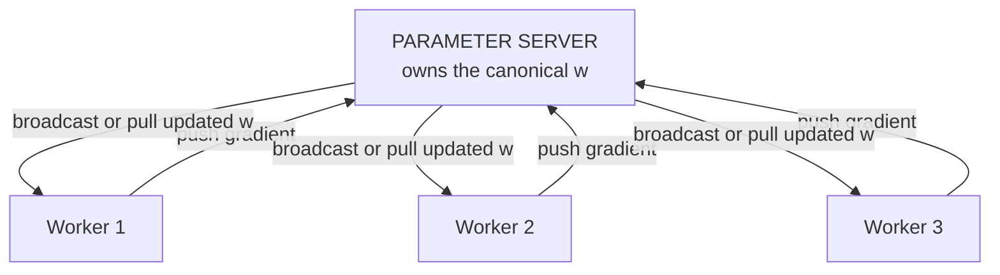
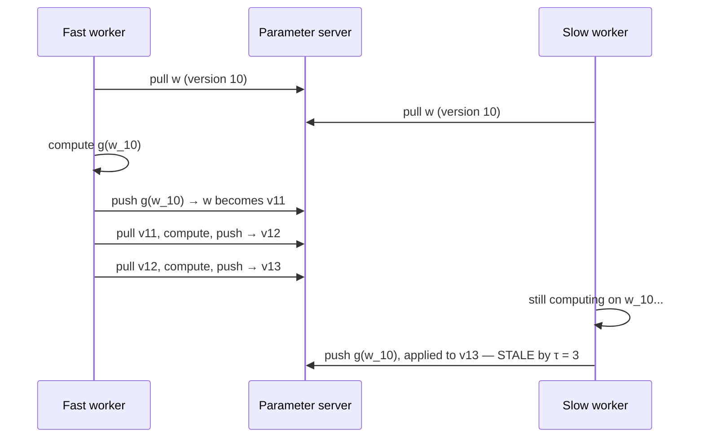
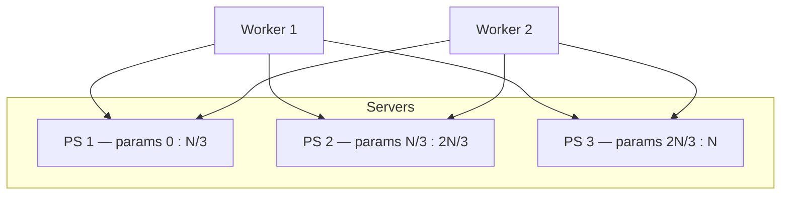

# 23. The parameter server, and what "the parameters at time t" means

[← 22. Data-parallel SGD and ring all-reduce](22-data-parallel-sgd-and-ring-all-reduce.md) | [↑ Table of contents](../../README.md) | [24. When the model does not fit →](24-when-the-model-does-not-fit-model-pipeline-fsdp.md)

---

### The question underneath the mechanism

The CS4787 treatment poses a question that looks pedantic and is not:[75]

> When reasoning about a distributed algorithm, what should we consider to be the value of the parameters at a
> given time?

On one machine this is trivial — `w_t` is whatever is in that array. In a distributed system **there is no
shared memory**; every machine holds its own copy, some staler than others. So "`w_t`" may not exist anywhere
in the system.

This is the same class of problem as §5 (a timeout is evidence of uncertainty, not proof of non-execution) and
§6 (what does "the current value" mean under replication). Distributed training does not escape it; it just
answers it in its own way. There are two answers:

- **All-reduce answers by construction.** §22 proved all copies are identical, so you may appoint any of them.
  A barrier defines time.
- **The parameter server answers by decree.** Appoint one machine the owner of truth. `w_t` is *by definition*
  what that machine holds.

Neither answer is more correct. They are different **consistency models**, and the choice determines what you
can prove.

### The architecture



Note the shape: a **hub**. Communication is `O(M)` through one node — exactly the bottleneck ring all-reduce
eliminated in §22. So the parameter server is *not* chosen for bandwidth. It is chosen for **asynchrony**, and
for the ability to shard a model that no single machine can hold.

### Synchronous parameter server

The server waits for all M gradients, sums, updates, broadcasts. Mathematically identical to all-reduce SGD —
the same statistical-equivalence proof applies — but with worse bandwidth at the hub and the same straggler
exposure (§21). Rarely the right choice unless you need the sharding.

### Asynchronous parameter server — the real motivation



The update rule becomes:

```
w_{t+1} = w_t − η · ∇ℓ(w_{t−τ_t}; ξ_t)
```

where `τ_t ≥ 0` is the **staleness**. The gradient is not wrong; it is *correct for a point the system has
already left*.

**What staleness costs.** For L-smooth objectives with bounded staleness, convergence requires roughly

```
η  ≲  1 / (L · (1 + τ_max))
```

The intuition: a stale gradient is a valid descent direction for `w_{t−τ}`; over τ steps the true gradient
rotates, and once that rotation exceeds a right angle you are ascending. Shrinking η bounds the rotation.
*(This is the shape of the standard delayed-SGD bound, stated as an order relationship rather than a specific
theorem's constants.)*

**The fundamental trade:**

| | Synchronous | Asynchronous |
|---|---|---|
| Hardware utilisation | Low — stragglers idle everyone | High — nobody waits |
| Steps per second | ∝ 1 / max_m T_m | ∝ Σ_m 1/T_m |
| Progress per step | Full | Degraded by τ |
| Reproducible? | Yes | **No** — update order is nondeterministic |
| Theory | Clean, inherits sequential SGD | Delay-dependent bounds |

You are trading **statistical efficiency** for **hardware efficiency**. Async wins when stragglers are severe
and τ stays small; sync wins otherwise.

**This exact trade recurs three more times in this guide**: as local steps in FedAvg (§26), as gossip staleness
in decentralised SGD (§25), and as agents acting on outdated shared state in orchestration (§30). Recognising
it as one pattern rather than four is most of the value of Part VII.

### Sharded parameter servers



When the parameters exceed one machine, partition them across P servers. A worker splits its gradient vector
and sends each slice to the owning server, later receiving the corresponding updated slice back.[75]

Two consequences worth naming:

1. **No single machine holds the whole model.** This is what "scale to very large models" means here.
2. Per-server bandwidth falls to roughly `O(M·N/P)`.

Structurally this communication pattern is an **all-to-all**, and it is the direct ancestor of ZeRO and FSDP
(§24), which take the same idea — shard the state, gather what you need, when you need it — and apply it
without a dedicated server tier.[57]

### Reducing what you send

Because the hub is bandwidth-bound (§20), the parameter server is where gradient compression pays most:

- **Sparsification / top-k.** Send only the largest-magnitude components. Deep Gradient Compression finds
  "99.9% of the gradient exchange in distributed SGD is redundant".[52] Critically, naive top-k is *biased* and
  can fail to converge; it works because of **error feedback** — the residual you did not send is accumulated
  locally and included next round.
- **Quantisation.** Fewer bits per component, trading variance for bytes.

Section 28 returns to this, because the same mechanism appears — unlabelled and unjustified — as "selective
communication" in the multi-agent literature.

### What to take from this section

1. In a distributed system there is no automatic meaning for "the parameters at time t"; all-reduce answers by
   construction, the parameter server by decree.
2. The parameter server reintroduces an `O(M)` hub; it earns that cost through asynchrony and sharding, not
   bandwidth.
3. Staleness τ is the price of asynchrony, and it is paid as a smaller admissible learning rate.
4. Statistical efficiency versus hardware efficiency is one trade that recurs throughout the rest of the guide.

---

[← 22. Data-parallel SGD and ring all-reduce](22-data-parallel-sgd-and-ring-all-reduce.md) | [↑ Table of contents](../../README.md) | [24. When the model does not fit →](24-when-the-model-does-not-fit-model-pipeline-fsdp.md)
