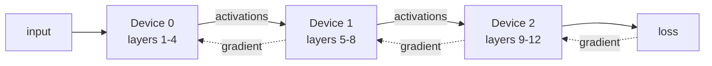
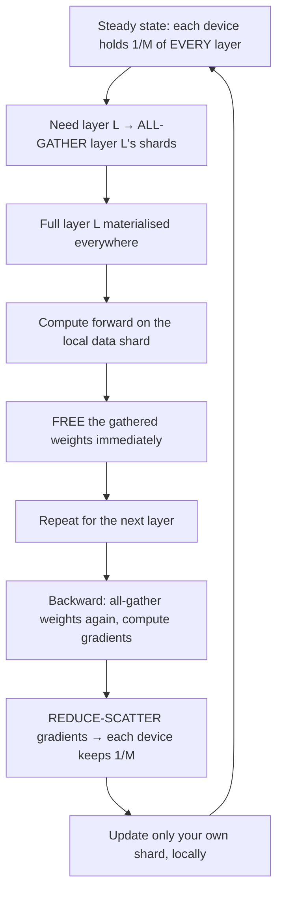

# 24. When the model does not fit: model, pipeline, tensor, and fully-sharded parallelism

[← 23. The parameter server](23-the-parameter-server-and-the-meaning-of-time.md) | [↑ Table of contents](../../README.md) | [25. Removing the centre →](../10-decentralized-and-multi-agent/25-removing-the-centre-gossip-consensus-and-topology.md)

---

Data parallelism (§22) **replicates** the model. If the model does not fit on one device, replication is
impossible — this is Wall 2 from §19, and it requires a different tool.

### Model parallelism — partition the layers



Each device owns a subset of the parameters, so forward *and* backward signals now traverse the network
between machines.[75] The fatal flaw is that the computation is **sequential**: while device 1 works, devices
0 and 2 idle. Utilisation is roughly 1/P. You have solved memory and destroyed throughput.

### Pipeline parallelism — refill the bubble

Split the minibatch into **micro-batches** so different stages work on different micro-batches at the same
instant. This is GPipe's contribution — making capacity beyond one accelerator's memory accessible without
architecture-specific infrastructure.[54]

```mermaid
gantt
    dateFormat X
    axisFormat %s
    title Pipeline schedule (F = forward, B = backward)
    section Device 0
    F1 :0,1
    F2 :1,2
    F3 :2,3
    F4 :3,4
    B1 :7,8
    B2 :8,9
    section Device 1
    F1 :1,2
    F2 :2,3
    F3 :3,4
    F4 :4,5
    B1 :6,7
    B2 :7,8
    section Device 2
    F1 :2,3
    F2 :3,4
    F3 :4,5
    F4 :5,6
    B1 :6,7
    B2 :7,8
```



The idle triangles at the start and end are the **pipeline bubble**:

```
bubble fraction = (P − 1) / (m + P − 1)
```

for P stages and m micro-batches. With P = 4 and m = 4, about 43% is wasted; with m = 32, about 8.6%. **So use
many micro-batches** — but micro-batches consume activation memory, which returns you to the constraint you
were escaping. PipeDream attacks the same problem from the scheduling side, reporting up to 95% communication
reduction versus data-parallel training for large networks and "perfect overlap of communication and
computation".[55]

### Tensor parallelism — split inside a layer

A third axis: partition a single matrix multiplication across devices (columns of one weight matrix, rows of
the next), so each device computes a slice of the same layer. This requires an all-reduce or all-gather **per
layer**, i.e. many small, extremely frequent collectives.

By §20's cost model, that is a **latency-sensitive, high-frequency** pattern — which is exactly why tensor
parallelism is confined *inside* a node, on the NVLink row of the hierarchy, and pipeline parallelism is used
*across* nodes. The physical hierarchy dictates the software mapping.

### Fully Sharded Data Parallel — the synthesis

FSDP is where §21's identity earns its keep. Recall:

```
All-Reduce = Reduce-Scatter + All-Gather
```

DDP holds a full replica and performs an all-reduce. FSDP instead **shards parameters, gradients, and optimizer
state across all workers** (1/M each — the sharded-parameter-server idea from §23, without a server tier) and
materialises what it needs, when it needs it. ZeRO frames this as removing the redundancy that data and model
parallelism leave in device memory.[57] PyTorch FSDP is the productionised form.[56]



Memory per device falls from `O(N)` to `O(N/M)` plus one materialised layer. Communication **volume** is the
same as DDP's all-reduce — because you have literally decomposed the all-reduce into its two halves and
interleaved computation between them. Same bytes, M times less memory, paid for with more individual messages
(which are, by §21, overlappable).

### 3D parallelism: the practical composition

| Axis | Splits | Solves | Primitive | Placement |
|---|---|---|---|---|
| **Data** | the batch | speed (Wall 1) | all-reduce / reduce-scatter | across pods |
| **Tensor** | within a layer | memory, per layer | all-reduce / all-gather, very frequent | **inside** a node |
| **Pipeline** | across layers | memory, depth | point-to-point activations | across nodes |

Frontier training runs compose all three, and **the mapping follows the α–β table from §20**: put the chattiest
axis on the fastest link. That is the practical punchline of this whole section.

### Choosing

```mermaid
flowchart TD
    SWhat is the binding constraint?
    S -->|"Too slow, model fits"| DP["Data parallel + ring all-reduce §22"]
    S -->|"Model does not fit"| MHow much too big?
    M -->|"Optimizer state dominates"| Z["FSDP / ZeRO sharding"]
    M -->|"Single layer too large"| T["Tensor parallel, inside a node"]
    M -->|"Too many layers"| P["Pipeline parallel, across nodes"]
    DP --> BPast the critical batch size?
    B -->|Yes| Z
```

### What to take from this section

1. Model parallelism solves memory and destroys utilisation; pipelining recovers utilisation at the cost of
   activation memory, governed by `(P−1)/(m+P−1)`.
2. Tensor parallelism is latency-bound and belongs inside a node.
3. FSDP is `All-Reduce = Reduce-Scatter + All-Gather` with computation interleaved: same bytes, `O(N/M)` memory.
4. Real systems compose all three axes, mapped onto the interconnect hierarchy.

---

[← 23. The parameter server](23-the-parameter-server-and-the-meaning-of-time.md) | [↑ Table of contents](../../README.md) | [25. Removing the centre →](../10-decentralized-and-multi-agent/25-removing-the-centre-gossip-consensus-and-topology.md)
