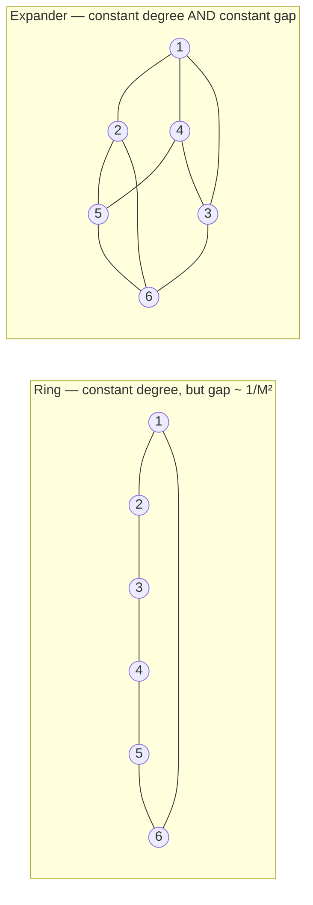

# 25. Removing the centre: gossip, consensus, and why topology is destiny

[← 24. When the model does not fit](../09-distributed-learning-foundations/24-when-the-model-does-not-fit-model-pipeline-fsdp.md) | [↑ Table of contents](../../README.md) | [26. Federated learning →](26-federated-learning-when-the-data-cannot-move.md)

---

> **Part VIII covers what happens once workers stop being interchangeable calculators** — once they hold their
> own data (§26), pursue their own rewards (§27), or may be actively wrong (§28).

Every architecture so far has had a centre: a root rank, a parameter server, a coordinator. Section 22 removed
the *bandwidth* bottleneck with a ring, but ring all-reduce still imposes a global barrier. This section
removes the centre entirely.

The multi-agent literature asserts constantly that decentralisation is more scalable — the CIO paper's whole
pitch is that "the framework eliminates the need for a global controller by leveraging collective intelligence
principles".[73] **That claim is true under a condition the paper never states.** This section supplies it.

### The model

Represent the system as a graph `G = (A, E)`: agents as nodes, communication links as edges. Each agent i
holds its own parameter vector `x_i`. Define a **mixing matrix** `W` where `W_ij > 0` only if `(i,j) ∈ E`, and

```
Σ_j W_ij = 1   and   Σ_i W_ij = 1      (doubly stochastic)
```

Each round, every agent replaces its value with a weighted average of its neighbours':

```
x_i(t+1) = Σ_{j ∈ N(i)} W_ij · x_j(t)        i.e.   X(t+1) = W · X(t)
```

### Why this converges

If W is doubly stochastic and symmetric, its eigenvalues satisfy `1 = λ₁ > λ₂ ≥ … ≥ λ_M > −1`, with `λ₁`'s
eigenvector the all-ones vector. Decomposing the initial state into its mean plus a deviation, the deviation
is multiplied by the remaining eigenvalues each round:

```
‖x(t) − x̄·1‖  ≤  ρ^t · ‖x(0) − x̄·1‖ ,      ρ = max(|λ₂|, |λ_M|)
```

**Disagreement decays geometrically at rate ρ.** The quantity `1 − ρ` is the **spectral gap**, and it is the
single number that characterises how good a communication topology is. Everything else about the graph is
detail.

### Topology is destiny

| Topology | Degree | Spectral gap `1 − ρ` | Rounds to consensus | Messages per round |
|---|---|---|---|---|
| Complete graph | M − 1 | 1 | **1** | `O(M²)` — unaffordable |
| Ring | 2 | `Θ(1/M²)` | **`O(M²)`** — terrible | `O(M)` |
| 2-D torus | 4 | `Θ(1/M)` | `O(M)` | `O(M)` |
| Hypercube | log M | `Θ(1/log M)` | `O(log M)` | `O(M log M)` |
| **Expander** | `O(1)` constant | **`Θ(1)`** | **`O(log M)`** | **`O(M)`** |



**This is the missing condition.** A decentralised design with constant degree and a *constant* spectral gap —
an expander — is genuinely scalable: `O(1)` messages per agent and `O(log M)` rounds to agreement. A
decentralised design on a ring has cheap rounds and `O(M²)` of them, which is **catastrophically worse than
the centralised baseline it claims to beat**.

So "we removed the central controller, therefore we scale" is not an argument. **Show me the spectral gap.**

### Decentralised SGD

Combine a local gradient step with a gossip step:

```
x_i(t+1) = Σ_j W_ij · [ x_j(t) − η·∇ℓ(x_j(t); ξ_j) ]
```

The key theoretical result, from the paper that asked precisely whether decentralised algorithms can beat
centralised ones: D-PSGD attains the **same asymptotic rate as centralised parallel SGD**, with the topology
affecting only a lower-order transient term.[50] Lian et al. motivate the work exactly as this section does —
"one bottleneck of centralized algorithms lies on high communication cost on the central node".[50]

That is the rigorous version of the CIO paper's claim.[73] Decentralisation genuinely costs nothing
asymptotically **and** removes the `O(M)` hub — provided ρ is bounded away from 1.

### Relationship to consensus in §6

This is *not* the same as Raft or Paxos.[7][30] The distinction is worth stating plainly because the word
"consensus" is overloaded:

| | **Agreement consensus** (§6) | **Average consensus** (here) |
|---|---|---|
| Goal | All nodes agree on **one exact value / log order** | All nodes converge to the **mean** of their values |
| Tolerates | Crash faults, with a quorum | Slow mixing; needs connectivity over time |
| Result | Exact, decided, durable | Approximate, asymptotic |
| Used for | Leader election, replicated state machines | Distributed optimisation, sensor fusion, MARL |
| Impossibility | FLP: no deterministic consensus with one crash in an async model[29] | None — but rate is entirely topology-bound |

Both are "consensus". Confusing them leads to demanding exactness where averaging suffices, or trusting
averaging where an exact decision is required (a publish, an approval, a commit — see §7 and §9).

### What to take from this section

1. Gossip averaging converges geometrically at rate ρ; the spectral gap `1 − ρ` characterises the topology.
2. Constant degree is not enough — a ring has constant degree and `O(M²)` mixing. Expanders give both.
3. Decentralised SGD matches centralised SGD asymptotically[50]; that is the real basis for decentralisation
   claims.
4. Average consensus ≠ agreement consensus. Do not substitute one for the other.

---

[← 24. When the model does not fit](../09-distributed-learning-foundations/24-when-the-model-does-not-fit-model-pipeline-fsdp.md) | [↑ Table of contents](../../README.md) | [26. Federated learning →](26-federated-learning-when-the-data-cannot-move.md)
