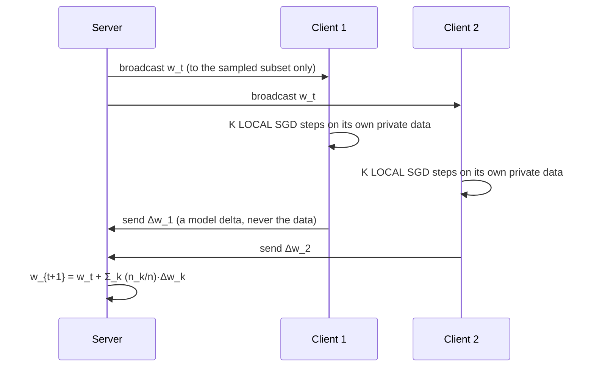
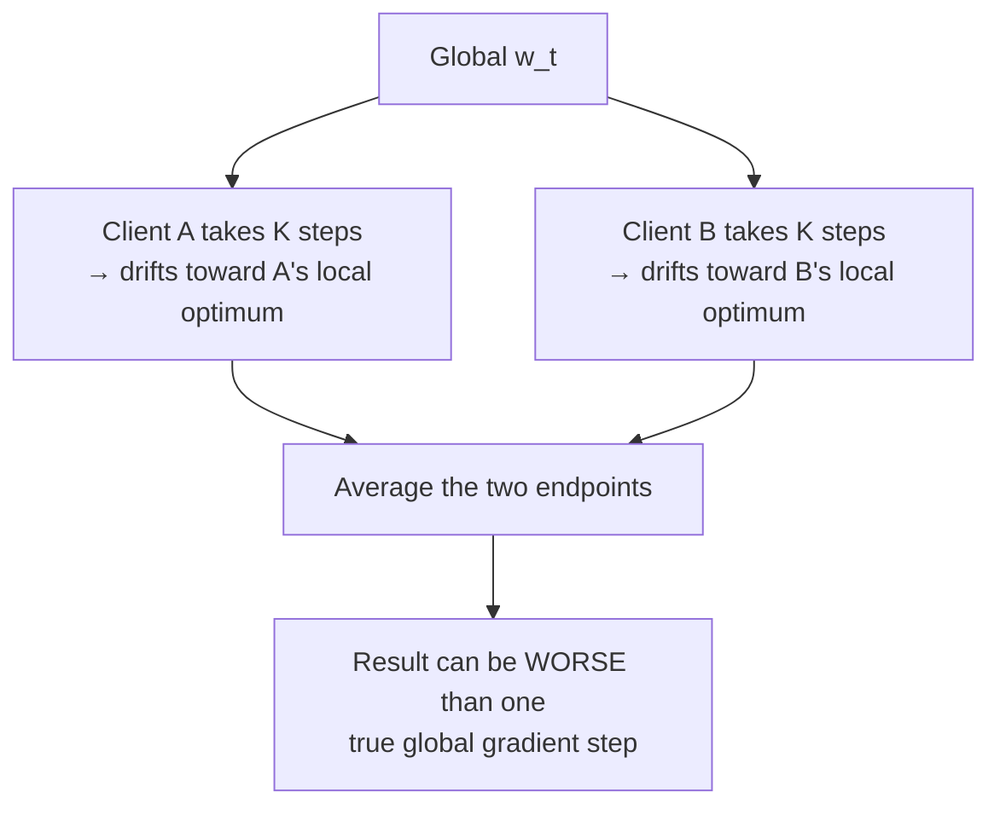

# 26. Federated learning: when the data cannot move

[← 25. Removing the centre](25-removing-the-centre-gossip-consensus-and-topology.md) | [↑ Table of contents](../../README.md) | [27. When workers have their own goals →](27-when-workers-have-their-own-goals-multi-agent-rl.md)

---

Wall 3 from §19: the computation must travel to the data. This is not distributed training with a worse
network — it is a different regime with different dominant costs.

### Federated is not just "distributed, but slower"

| | Distributed (datacenter) | Federated |
|---|---|---|
| Who owns the data | You | Someone else — privacy or contract |
| Data distribution | You shuffle it → effectively IID | **Non-IID**, unbalanced, correlated |
| Nodes | Identical, reliable | Heterogeneous devices that drop out mid-round |
| Network | InfiniBand, β ≈ 4e-11 | Cellular/consumer, β ≈ 1e-6 — **five orders worse** (§20) |
| Participation | 100% every step | A sampled 1–5% per round |
| Dominant cost | Compute | **Communication, overwhelmingly** |

Because communication is ~10⁵ times more expensive, the entire design inverts: **do as much local work as
possible between synchronisations.** Kairouz et al. define the setting as clients that "collaboratively train a
model under the orchestration of a central server, while keeping the training data decentralized".[63]

### FedAvg



The global objective is a weighted sum of client objectives, `F(w) = Σ_k p_k·F_k(w)` with `p_k = n_k/n`.
McMahan et al. advocate precisely this: leaving "the training data distributed on the mobile devices".[51]

Notice that FedAvg is **asynchrony in space rather than time**: instead of one worker running ahead by τ steps
(§23), every worker runs ahead by K steps from a shared point. The pathology is correspondingly similar.

### Client drift — the central pathology

With IID data all client objectives share a minimiser, so local steps all point the same way. With **non-IID**
data they do not:



SCAFFOLD makes this precise, obtaining tight rates for FedAvg and proving "that it suffers from `client-drift'
when the data is heterogeneous (non-iid), resulting in unstable and slow convergence".[58] The error floor
grows with the number of local steps K and with the **gradient dissimilarity** across clients — schematically:

```
error floor  ∝  η² · K² · ζ²        ζ² = a bound on how much ∇F_k differs from ∇F
```

So **K is a direct knob on the communication/accuracy trade**: larger K means fewer rounds and less network
cost, but more drift and a worse model. That is the federated form of §23's statistical-versus-hardware
efficiency trade.

**Corrections:**

- **SCAFFOLD** — control variates that estimate and subtract the drift direction, i.e. variance reduction
  applied across clients.[58]
- **FedProx** — add a proximal term `(μ/2)·‖w − w_t‖²` to the local objective, anchoring local work near the
  global point.

### The structural rhyme worth internalising

| Setting | Pathology | Mechanism | Knob |
|---|---|---|---|
| Async parameter server (§23) | Staleness τ | Worker optimises a point the system has left **in time** | η ≲ 1/(L(1+τ)) |
| FedAvg (§26) | Client drift | Worker optimises a point the system has left **in objective** | K, μ, control variates |
| Gossip (§25) | Disagreement | Workers have not yet mixed | spectral gap `1 − ρ` |
| Agent orchestration (§30) | Stale/divergent context | Agent reasons from outdated shared state | checkpoint and re-read |

These are four presentations of the same underlying fact: **local progress made against a global state you no
longer share must be reconciled, and the reconciliation is never free.**

### Privacy is not automatic

Keeping raw data local is necessary, not sufficient. Model updates leak — gradients can be inverted to recover
training examples. Production federated systems add secure aggregation (the server sees only the sum) and/or
differential privacy (calibrated noise, at an accuracy cost). Kairouz et al. treat the gap between "data
minimisation" and actual privacy guarantees as a central open problem.[63] Connect this to §11's boundary
work and §14's security posture: *location of data is one control among several, not the control.*

### What to take from this section

1. Federated learning is a different regime, defined by communication costing ~10⁵× more (§20) and by non-IID
   data.
2. FedAvg trades rounds for local steps; K is the knob and client drift is the cost.[58]
3. Drift, staleness, and disagreement are the same phenomenon in three settings.
4. Local data ≠ privacy; updates leak, and mitigations cost accuracy.

---

[← 25. Removing the centre](25-removing-the-centre-gossip-consensus-and-topology.md) | [↑ Table of contents](../../README.md) | [27. When workers have their own goals →](27-when-workers-have-their-own-goals-multi-agent-rl.md)
