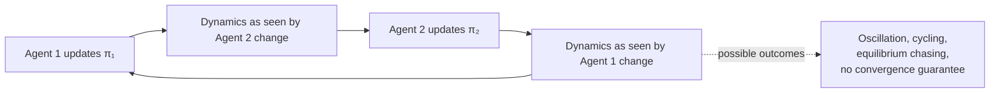

# 27. When workers have their own goals: multi-agent reinforcement learning

[← 26. Federated learning](26-federated-learning-when-the-data-cannot-move.md) | [↑ Table of contents](../../README.md) | [28. Robustness →](28-robustness-byzantine-aggregation-and-reading-claims.md)

---

Everything up to §26 assumed workers **cooperate on a single objective**. A distributed SGD worker has no
preferences; it is a calculator. This section relaxes that, and a genuinely new class of difficulty appears —
one with no analogue anywhere in Part VII.

### The setting

Agents `A = {a₁, …, a_N}`. Agent i observes a local state `s_i`, acts via policy `π_i`, receives reward
`r_i`. The collective objective:

```
maximise over π₁..π_N :   E[ Σ_{t=0..T} γ^t · Σ_{i=1..N} r_i^(t) ]
```

This is the formulation the CIO paper adopts.[73] Two problems appear that distributed SGD never faces.

### Problem A — Non-stationarity

From agent i's point of view, the environment's transition dynamics are:

```
P_i(s′ | s, a_i) = Σ_{a_-i}  π_-i(a_-i | s) · P(s′ | s, a_i, a_-i)
                              ^^^^^^^^^^^^^^
                              changing as the others learn
```

Because `π_-i` changes at every step, **`P_i` is time-varying**. The agent is not in a Markov decision process.
The Markov property — the assumption underneath Q-learning, policy gradients, and every convergence proof you
have — is violated.

MADDPG states the problem exactly: "Q-learning is challenged by an inherent non-stationarity of the
environment, while policy gradient suffers from a variance that increases as the number of agents grows".[61]



**This is why stability, not peak performance, is the hard part of MARL** — and why papers in this space
report "coordination stability" experiments at all.[73]

**The standard resolutions** (none of which the CIO paper names, though its architecture implicitly needs one):

- **CTDE — Centralised Training, Decentralised Execution.** A centralised critic observes all agents during
  training, so *the critic's* input is stationary; only the actors are decentralised at execution time. QMIX
  motivates this directly: "it is often possible to train the agents in a centralised fashion in a simulated or
  laboratory setting, where global state information is available and communication constraints are
  lifted".[59] MADDPG[61] and COMA[60] are the same family.
- **Opponent modelling.** Explicitly predict `π_-i` and condition on it.
- **Parameter sharing.** All agents share weights, collapsing the joint policy space.

Note what CTDE really is: **you did not eliminate the centre, you moved it to training time.** That is an
honest and often correct engineering trade — and it is the direct analogue of §23's "appoint an owner of truth
by decree".

### Problem B — Credit assignment

If the team succeeds, which agent caused it? Under a shared global reward, each agent's learning signal is
polluted by the noise of the other N−1 agents' choices. The gradient signal-to-noise ratio degrades roughly as
`1/√N`: **adding agents makes learning strictly harder**, independent of any compute or communication
consideration. This is a statistical wall, not a systems wall, and no amount of bandwidth fixes it.

**Rigorous fixes:**

| Method | Mechanism |
|---|---|
| **Difference rewards** | `D_i = R(a) − R(a_-i, c_i)` — compare the global reward against a counterfactual where i took a default action |
| **COMA** | A centralised critic computes a counterfactual advantage, marginalising out agent i's own action[60] |
| **QMIX** | Factorise the joint value so that `∂Q_tot/∂Q_i ≥ 0`, making per-agent greedy action selection consistent with global greedy[59] |

### Reading the CIO framework honestly

The CIO paper[73] proposes decentralised decision-making, adaptive agent collaboration, and dynamic resource
allocation. Each named mechanism is real and defensible. None is derived, bounded, or ablated. The value of
this guide's treatment is the translation — **what each phrase is, in a literature where it has a proof**:

| CIO's phrase | What it actually is | Rigorous form and the catch |
|---|---|---|
| "selective communication based on a **relevance score** above a **threshold**" | **Gradient sparsification** (top-k) | Deep Gradient Compression finds 99.9% of gradient exchange redundant[52]. **But naive thresholding is biased**; it converges only with **error feedback** — accumulate the unsent residual locally and include it next round. A bare threshold rule has no convergence guarantee. |
| "**adaptive weighting** prioritising reliable or relevant agents" | A **learned mixing matrix** — attention- or trust-weighted gossip | Valid, but §25's consensus proof requires W to remain **doubly stochastic**; otherwise agents converge to a *weighted* average, not the mean, biasing the optimum. Sinkhorn normalisation is the standard repair. |
| "**consensus** through iterative exchange" | **Average consensus** | Exactly §25. Rate ρ^t, guaranteed only if the union graph stays connected over bounded intervals — and the paper never specifies its topology. |
| "**confidence scores**, prioritise reliable agents" | **Robust aggregation** | §28. Confidence weighting alone has a breakdown point near zero. |
| "**compression** of updates" | Quantisation | Unbiased schemes trade variance for bits; sign-based schemes need majority vote to converge. |

Treat the CIO framework as a **well-chosen menu** whose rigorous versions live elsewhere — and cite the
elsewhere. The selective-overview literature is the right entry point.[64]

### What to take from this section

1. Once workers have their own rewards, the environment becomes non-stationary and every single-agent
   convergence guarantee is void.[61]
2. CTDE restores stationarity during training by reintroducing a centre — at training time only.[59][60]
3. Credit assignment degrades as `1/√N`; more agents is statistically harder, not just more expensive.
4. "Selective communication" is sparsification and needs error feedback; "adaptive weighting" is a mixing
   matrix and needs double stochasticity. Name the mechanism, then check its conditions.

---

[← 26. Federated learning](26-federated-learning-when-the-data-cannot-move.md) | [↑ Table of contents](../../README.md) | [28. Robustness →](28-robustness-byzantine-aggregation-and-reading-claims.md)
