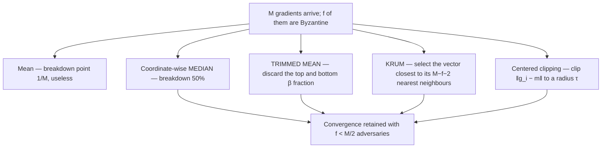

# 28. Robustness: Byzantine aggregation, and how to read a claim

[← 27. When workers have their own goals](27-when-workers-have-their-own-goals-multi-agent-rl.md) | [↑ Table of contents](../../README.md) | [29. LLM agent orchestration →](../11-agentic-orchestration-at-scale/29-llm-agent-orchestration-architecture-and-protocols.md)

---

### The impossibility that starts the subject

Plain averaging — the operation at the heart of all-reduce (§22), gossip (§25), and FedAvg (§26) — is **not
robust at all**:

```
ḡ = (1/M) · Σ_i g_i
```

A **single** malicious worker can set `ḡ` to any vector it chooses. To force the mean to `v`, send

```
g₁ = M·v − Σ_{i≥2} g_i
```

The **breakdown point** of the mean is `1/M → 0`. One bad node in ten thousand destroys training. This is not
a corner case; it is a consequence of linearity, and it applies to every averaging scheme in this guide.

Yin et al. frame the motivation precisely: in a decentralised environment "some computing units may behave
abnormally, or even exhibit Byzantine failures — arbitrary and potentially adversarial behavior".[65]

### Robust aggregators



**Krum**, concretely: score agent i by `Σ over its M−f−2 nearest neighbours of ‖g_i − g_j‖²`, and select the
minimiser. The rationale is statistical: honest gradients **cluster**, because they are noisy estimates of the
same true gradient. An attacker must either sit inside the honest cluster — in which case it is harmless — or
sit outside it, in which case it is detectable.

### The price of robustness

Yin et al.'s contribution is a sharp analysis of the statistical rates of robust estimators.[65] The shape of
the result:

```
statistical error  ∝   σ/√M   +   (f/M)·σ
                       ^^^^^       ^^^^^^^
                    ideal rate   robustness tax
```

**You cannot have both optimal statistical efficiency and robustness.** That is the honest framing, and it is
the answer to anyone who proposes robustness as a free add-on.

Worse, and more practically: **robust aggregation degrades under non-IID data.** Honest clients with genuinely
different distributions look exactly like attackers to a median. And non-IID is precisely the federated regime
(§26). Composing robustness with heterogeneity remains an open problem — which is a far sharper thing to say in
a design review than "we handle Byzantine faults".

### Relation to the rest of the guide

- §5 established that partial failure means you cannot infer outcome from silence. Byzantine faults are
  strictly worse: a node can respond promptly and *lie*.
- §9's fencing and leases stop a stale owner from committing. Robust aggregation stops a *present, active*
  participant from poisoning a computation. They defend different things.
- §30 shows the agentic analogue: an LLM agent that returns a confident, fluent, wrong answer is a Byzantine
  worker, and averaging opinions across agents inherits the same breakdown point.

### How to read an empirical claim

Part VII and VIII lean on published results; this guide also asks you to discount some. The discipline, applied
to the CIO paper's scalability table[73], is worth writing out because it generalises.

Reported latency and reward at three scales:

| Agents | Baseline latency | Proposed latency | **Baseline per agent** | **Proposed per agent** | Baseline reward | Proposed reward |
|---|---|---|---|---|---|---|
| 20 | 120 | 90 | **6.0** | **4.5** | 130 | 160 |
| 50 | 300 | 200 | **6.0** | **4.0** | 140 | 180 |
| 100 | 600 | 350 | **6.0** | **3.5** | 150 | 200 |

The two bold columns are computed, not reported. The baseline is *exactly* 6.0 ms per agent at every scale.
The proposed method is *exactly* 4.5, 4.0, 3.5 — a perfect arithmetic sequence. Both reward columns are also
perfect arithmetic sequences (+10 and +20 per row).

Real measurements do not do this. Combined with the absence of error bars, seeds, a named environment,
released code, or evidence of baseline tuning, the appropriate reading is: **the architecture is plausible;
the tables are illustrations, not evidence.**

The general checklist:

1. **Recompute the derived quantity** the authors did not show (per-unit cost, ratio, efficiency). Synthetic
   numbers rarely survive it.
2. **Look for variance.** No error bars, no seeds, no claim.
3. **Check whether the baseline was tuned.** An untuned baseline is not a baseline.
4. **Check the reference list for topical coherence.** A scalability paper citing mostly unrelated work from a
   single cluster of authors is a signal about the review process, not the idea.
5. **Separate the architecture from the evidence.** Both papers in this repository's source set contribute
   useful *structure*; neither contributes reliable *measurements*.[73][74]

This is the same discipline §1 applies to company claims and §15 applies to architectural fashion: **cite what
was verified, label what was assumed.**

### What to take from this section

1. The mean has breakdown point `1/M`; one Byzantine worker suffices to control it.
2. Median, trimmed mean, Krum, and clipping restore convergence for `f < M/2` — at a statistical cost that is
   irreducible.[65]
3. Robust aggregation and non-IID data conflict, and federated learning needs both.
4. Recompute derived quantities before believing a results table.

---

[← 27. When workers have their own goals](27-when-workers-have-their-own-goals-multi-agent-rl.md) | [↑ Table of contents](../../README.md) | [29. LLM agent orchestration →](../11-agentic-orchestration-at-scale/29-llm-agent-orchestration-architecture-and-protocols.md)
