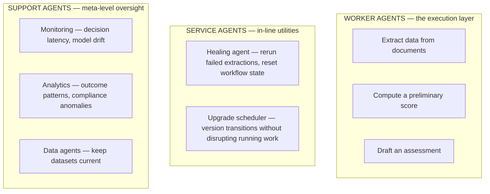
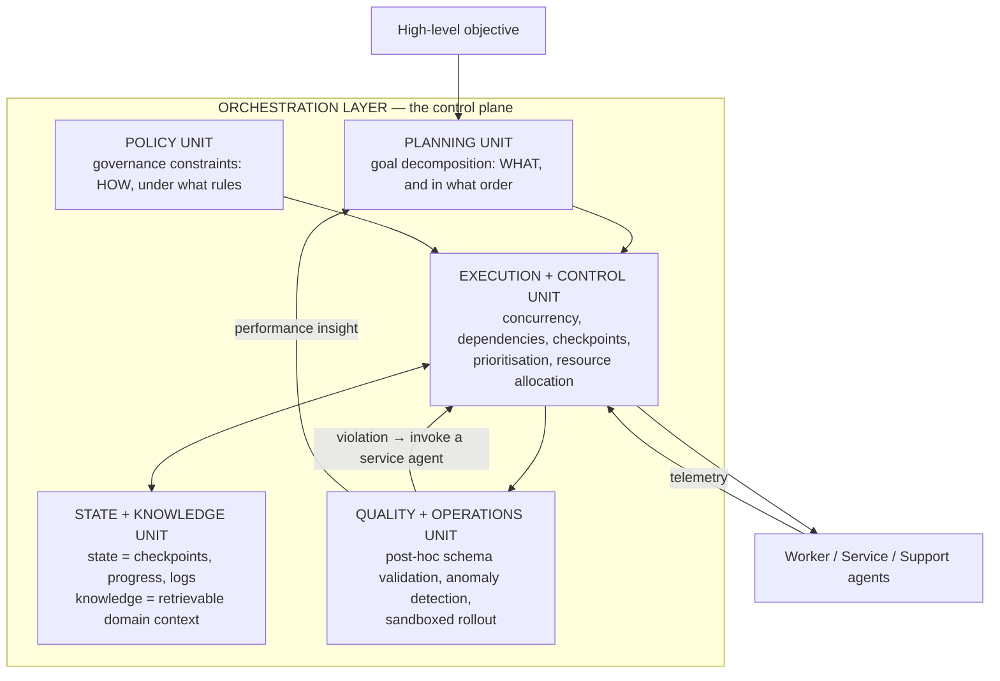
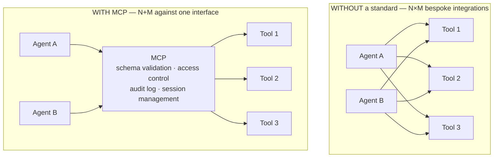

# 29. LLM agent orchestration: architecture and protocols

[← 28. Robustness](../10-decentralized-and-multi-agent/28-robustness-byzantine-aggregation-and-reading-claims.md) | [↑ Table of contents](../../README.md) | [30. The isomorphism →](30-the-isomorphism-and-the-two-laws.md)

---

> **Part IX is the payoff.** Sections 19–28 built the mechanics of many machines agreeing on one evolving
> value. This part shows that LLM agent systems are solving the same problem with tokens instead of floats —
> and names the one thing that is genuinely new.

Section 10 of this guide already argued that agents need durable workflows. This section supplies the
*architecture* that sits on top of that durability, following the orchestration survey's decomposition.[74]

### The agent taxonomy

The distinction that actually matters:

- **Worker** — performs the task.
- **Service** — acts *during* execution to keep it running (retry, reset, restore a checkpoint).
- **Support** — observes *about* execution to inform optimisation.

That is a control-theory separation — **plant, controller, observer** — and it is the reason the taxonomy is
worth adopting even if you dislike the labels. It tells you which component may *mutate* workflow state
(service) and which may only *read* it (support). Compare §14: the same separation between remediation and
observability.

### The orchestration layer

Two separations in this design are genuinely well-observed and worth keeping:[74]

1. **Policy constrains *before and during*; quality validates *after*.** These are different failure modes and
   different code. Conflating them produces systems that either block legitimate work or detect violations too
   late to act.
2. **Operational state is separate from knowledge state.** Where am I in the workflow, versus what do I know
   about the domain. This is the program-counter-versus-heap split, and it is what lets you checkpoint and
   replay execution (§10) without corrupting retrieved context, or refresh knowledge without losing progress.

### MCP and A2A — two axes, not competitors

| | **MCP** | **A2A** |
|---|---|---|
| Axis | Agent ↔ **tool / data** | Agent ↔ **agent** |
| Shape | Client–server; the agent is the client | Peer-to-peer, optionally orchestrator-mediated |
| Carries | Tool calls, resources, prompts | Delegation, negotiation, intermediate results |
| Guarantees | Schema conformance, access control, auditability | Authenticated exchange, capability declaration, opacity |
| **§21 analogue** | **Pull** — request a capability from a provider | **Point-to-point push** between peers |

MCP's own framing is the `N×M → N+M` argument in one image: "Think of MCP like a USB-C port for AI
applications. Just as USB-C provides a standardized way to connect electronic devices, MCP provides a
standardized way to connect AI applications to external systems."[70] It is the same argument as a device
driver ABI, an instruction set, or POSIX — and it is correct for the same reason.

A2A's documentation states the division of labour explicitly: "A2A: Standardizes communication among agents,
across organizations and frameworks. MCP: Connects models to data and external resources… A2A complements MCP:
it covers a distinct but related part of agent interaction."[71] A2A adds a property MCP does not need:
**opacity** — "agents interact without needing to share internal memory, tools, or proprietary logic".[71]
That is a genuine cross-organisational requirement with no analogue in distributed SGD, where every worker is
inside the same trust boundary.

Work combining both protocols in one framework is already appearing.[68] So is work on the scaling problem
that MCP creates once tool inventories grow: ScaleMCP notes that existing tool-selection frameworks rely on
"error-prone manual updates to monolithic local tool repositories, leading to duplication, inconsistencies,
and inefficiencies".[69] **A registry is itself distributed state, and it needs the same treatment as any
other replicated catalogue** (§6).

### Static structure is the current frontier

Two independent 2025 results converge on the same limitation: **fixed agent roles and fixed communication
graphs do not adapt as task complexity grows.**

- HALO argues that existing systems "rely on predefined agent-role design spaces and static communication
  structures, limiting their adaptability… leading to subpar performance on highly specialized and expert-level
  tasks", and proposes hierarchical orchestration in response.[66]
- Evolving Orchestration makes the same observation about scale: "most approaches rely on static organizational
  structures that struggle to adapt as task complexity and agent numbers grow, resulting in coordination
  overhead and inefficiencies".[67]

Read those through §25 and the point sharpens considerably: **these papers are describing a bad spectral
gap.** A static, hand-drawn agent communication graph is a topology nobody checked. Hierarchy (HALO) and
evolved structure (Evolving Orchestration) are both attempts to find a better one. The distributed-optimisation
literature already has the vocabulary for evaluating that — it is the one thing the agentic literature is
currently missing.

### What to take from this section

1. Worker / service / support is plant / controller / observer — it tells you who may mutate state.
2. Policy constrains before; quality validates after. Operational state is separate from knowledge state.
3. MCP is the tool axis (pull, `N×M → N+M`); A2A is the peer axis (push, plus opacity across trust
   boundaries).[70][71]
4. Static agent topologies are the current bottleneck[66][67] — and §25 already tells you how to measure one.

---

[← 28. Robustness](../10-decentralized-and-multi-agent/28-robustness-byzantine-aggregation-and-reading-claims.md) | [↑ Table of contents](../../README.md) | [30. The isomorphism →](30-the-isomorphism-and-the-two-laws.md)
