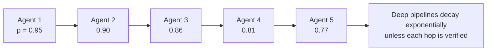

# 30. The isomorphism, and the two laws that are genuinely new

[← 29. LLM agent orchestration](29-llm-agent-orchestration-architecture-and-protocols.md) | [↑ Table of contents](../../README.md) | [31. The unified ladder →](31-the-unified-ladder-and-how-to-say-it.md)

---

### The isomorphism

This table is the single highest-value artifact in Part VII–IX. Read it twice.

| Distributed ML | LLM agent orchestration | The shared invariant |
|---|---|---|
| Parameter server (§23) | Central orchestrator (§29) | One appointed owner of truth; hub bottleneck and single point of failure |
| All-reduce, no hub (§22) | A2A peer delegation (§29) | No centre, therefore a consistency argument is owed |
| Barrier (§21) | Workflow join / checkpoint (§10) | The slowest member sets the pace |
| Straggler (§21) | Slow or hung agent | `E[max] ≫ E[mean]`; variance becomes latency |
| Gradient staleness τ (§23) | Agent reasoning from outdated shared state | Optimising a point the system has already left |
| Overlap compute and comms (§21) | Parallel agent fan-out | Hide the latency or pay it as a stall |
| Bandwidth cost `β·n` (§20) | **Token cost of forwarded context** | Bytes on the wire are literally money |
| Checkpointing (§10) | State unit checkpoints (§29) | Recover without redoing everything |
| Byzantine-robust aggregation (§28) | Quality unit, guardrails, consistency checks | Never trust a single node's output |
| Non-IID client drift (§26) | Agents with divergent context windows | A local optimum is not a global optimum |
| Gradient sparsification (§23) | Passing summaries, not full transcripts | Compress or drown |
| NCCL / MPI (§21) | MCP + A2A (§29) | A standard interface beats `N×M` bespoke glue |
| Critical batch size (§22) | Diminishing returns from more parallel agents | More parallelism stops buying progress before it stops costing money |
| Spectral gap (§25) | Static vs hierarchical agent topology[66][67] | Who talks to whom determines how fast the system agrees |

**Nothing in the left column is optional knowledge for someone building the right column.** The failure modes
were characterised decades ago under different names; the agentic literature is rediscovering them, and the
teams that know both vocabularies ship the reliable systems.

### What is genuinely new

Exactly one thing, and it is important enough to state precisely.

In distributed SGD, a message is either **delivered or not**. Corruption is detectable — a checksum fails, a
value is NaN, a node is silent. §5's taxonomy of outcomes is complete.

In an agent system, a message can be **delivered, well-formed, schema-valid, confident, fluent, and wrong.**
There is no checksum for "this summary misrepresents the document". The channel is **semantically lossy**, and
the loss is invisible at the transport layer.

That single difference produces the two laws below.

### Law 1 — Error compounding

If each agent produces a correct result with probability p, a **chain** of n agents succeeds with probability

```
P_success = p^n
```

| p | n = 3 | n = 5 | n = 10 | n = 20 |
|---|---|---|---|---|
| 0.99 | 0.97 | 0.95 | 0.90 | 0.82 |
| 0.95 | 0.86 | 0.77 | 0.60 | 0.36 |
| 0.90 | 0.73 | 0.59 | 0.35 | 0.12 |



*(Independence is an idealisation; correlated failures — a shared bad retrieval, a shared misreading of the
prompt — make this optimistic, not pessimistic.)*

**The consequence, stated as a design rule:** the quality and operations unit of §29 is **not governance
overhead — it is error correction.** Validating at each hop converts `p^n` into roughly `(p + (1−p)·q)^n`,
where q is the probability the check catches and repairs the error. This is Shannon's argument: redundancy buys
reliability over a noisy channel. **LLM agents are a noisy channel**, so the same remedy applies.

This connects directly to the schema-validation and eval discipline in §11 and §14, and to the approval-of-the-
exact-artifact rule in §7. It is also why §29's separation of *policy before* and *quality after* is load-
bearing rather than decorative.

Corollaries worth stating explicitly:

- **Prefer shallow-and-wide to deep-and-narrow.** Parallel fan-out with one aggregation step is `p` once, not
  `p^n`.
- **Every unverified hop is a multiplication.** Count the hops in your architecture diagram; that exponent is
  your reliability.
- **Verification need not be another LLM.** A schema check, a unit test, a database constraint, or a
  deterministic recomputation is cheaper and strictly more trustworthy.

### Law 2 — Amdahl, still

```
Speedup ≤ 1 / (s + (1−s)/M)   →   1/s   as M → ∞
```

where s is the inherently serial fraction (§3). In an agent system, s includes **planning, final aggregation,
and every barrier**. If planning is 20% of the work, **one hundred agents cannot exceed 5×** — ever.

And the agentic bandwidth term is **tokens**. If N agents each broadcast their context to all others, you pay
`O(N²)` in tokens, and tokens are billed. §22's answer applies verbatim: do not broadcast. Use a hub with
summaries, or a hierarchy. **That is reduce-scatter for prose** — and it is precisely the structural move HALO
makes.[66]

### The cost model, applied

Combining §20 and the two laws gives a usable back-of-envelope for any agent pipeline:

```
latency  ≈  Σ over hops of ( α_model + β_token · tokens_in_that_hop )
cost     ≈  Σ over hops of ( price_per_token · tokens_in_that_hop )
reliability ≈ Π over hops of ( p_hop + (1 − p_hop) · q_hop )
```

Three quantities, three levers: **fewer hops** (raises reliability and cuts both latency and cost), **less
context per hop** (cuts cost and latency), **better verification per hop** (raises reliability at the price of
an extra hop). Almost every real agent-architecture decision is a trade among these three, and writing them
down beats arguing about frameworks.

### On the case-study numbers in the literature

Reported figures such as "95% document-parsing accuracy", "20× faster approvals with 80% cost reduction",
"80% of support incidents resolvable without a human", and "50% reduction in development effort" trace, in the
orchestration survey, to vendor blog posts, a consultancy report, and a low-tier journal.[74] The survey
itself runs **no experiments**; its contribution is the taxonomy and the protocol framing, both of which are
genuinely useful.

Apply §28's checklist. Separate the architecture from the evidence, and cite each to the right source.

### What to take from this section

1. Agent orchestration is distributed systems with tokens instead of floats; the whole left column of the
   isomorphism table transfers.
2. The one genuinely new failure mode is the **semantically lossy channel** — confidently wrong, undetectable
   at transport.
3. `P_success = p^n`: validation gates are error-correcting codes, not bureaucracy. Prefer wide to deep.
4. Amdahl still caps everything, and broadcast context is an `O(N²)` token bill.

---

[← 29. LLM agent orchestration](29-llm-agent-orchestration-architecture-and-protocols.md) | [↑ Table of contents](../../README.md) | [31. The unified ladder →](31-the-unified-ladder-and-how-to-say-it.md)
