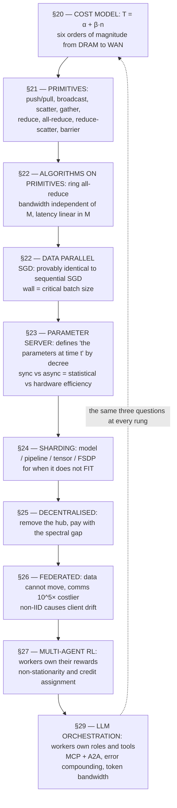

# 31. The unified ladder, and how to say it out loud

[← 30. The isomorphism and the two laws](30-the-isomorphism-and-the-two-laws.md) | [↑ Table of contents](../../README.md) | [Source-appraisal appendix →](../12-appendix/source-appraisal-three-documents.md)

---

### The ladder

### The three questions, answered at every rung

| Rung | Who holds the truth? | How do the copies agree? | What does agreeing cost? |
|---|---|---|---|
| All-reduce SGD (§22) | Everyone, provably identically | Barrier plus ring all-reduce | `2Nβ + 2(M−1)α`; idle during the sync unless overlapped |
| Sync parameter server (§23) | The server | Push, sum, broadcast | `O(M·N)` at the hub |
| Async parameter server (§23) | The server, nominally | Nobody — eventual | Staleness τ, paid as a smaller η |
| FSDP (§24) | Sharded; no one holds all | All-gather on demand | Same bytes as DDP, more messages, `O(N/M)` memory |
| Gossip / decentralised (§25) | Nobody | Neighbour averaging | `ρ^t` decay — entirely topology-dependent |
| Federated (§26) | The server, between rounds | FedAvg every K local steps | Drift ∝ `η²K²ζ²` |
| Multi-agent RL (§27) | Each agent, divergently | Consensus plus shaped rewards | Non-stationary; no inherited guarantee |
| LLM orchestration (§29) | The state and knowledge unit | Orchestrator, A2A, validation gates | Tokens, latency, and `p^n` reliability decay |

### How to weigh the three source documents

This part was built from three documents of very different evidential weight. Distinguishing them is itself
part of the skill.

| | Course notes on distributed ML[75] | Orchestration survey[74] | CIO framework paper[73] |
|---|---|---|---|
| Type | Teaching material on established results | Survey / position paper | Claimed empirical contribution |
| Evidence base | Textbook, decades-validated | Cites vendor blogs and a consultancy report | Its own tables, not reproducible |
| Trust | **High** — this is settled ground | **Medium** — taxonomy sound, ROI figures are marketing | **Low on results, medium on architecture** |
| Use it for | The mechanics and the cost models | Vocabulary: worker/service/support, MCP vs A2A, the four orchestration units | A checklist of mechanisms to then look up properly (§27) |

**Where they conflict, the settled material wins.** It describes physics; the others describe intentions.

### Saying it out loud

Section 17 covers delivery technique. This is the specific argument for this material — compressed, in the
order a listener can follow.

> Scaling is always the same trade: splitting work is free, re-synchronising is not. So the first question is
> *which wall you hit* — too slow, does not fit, or cannot move the data — because each demands a different
> split, and applying the wrong one buys nothing.
>
> At the metal the cost model is `α + β·n`, and there are six orders of magnitude between an intra-node link
> and a wide-area one. Every good design is a mapping of communication patterns onto that hierarchy: the
> chattiest axis on the fastest link — tensor parallelism inside a node, pipeline across nodes, data
> parallelism across pods.
>
> Data-parallel SGD with ring all-reduce is the workhorse because it is *provably identical* to sequential SGD,
> so hyperparameters and theory transfer, and because its bandwidth cost is independent of worker count. It
> dies at the critical batch size — a statistical limit, not a hardware one — and that is where you switch from
> sharding the batch to sharding the model. FSDP is just all-reduce decomposed into reduce-scatter plus
> all-gather, with computation interleaved.
>
> The parameter server answers a subtler question: with no shared memory, what *are* "the parameters at time
> t"? Synchronous answers with a barrier and pays for stragglers. Asynchronous answers "whatever the server
> holds" and pays with staleness, which forces a smaller learning rate. That is statistical efficiency traded
> against hardware efficiency — and it is the same trade as local steps in federated learning.
>
> Decentralised systems remove the hub entirely and pay with the spectral gap of the communication graph.
> Neighbour gossip converges at `ρ^t`, and decentralised SGD matches centralised SGD asymptotically — but only
> when the topology has a decent gap. A ring does not; an expander does. So "we removed the controller,
> therefore we scale" is not an argument until someone shows the topology.
>
> Once workers have their own rewards, a problem appears that has no analogue in distributed SGD: from each
> agent's view the environment is non-stationary, because it contains other learners. That breaks the Markov
> property and voids the convergence guarantees. Centralised-training/decentralised-execution exists precisely
> to restore stationarity during training — which is to say, it puts the centre back, at training time.
>
> LLM agent systems are rediscovering all of this with tokens instead of floats. The orchestrator is a
> parameter server with the same hub bottleneck. A2A is point-to-point; MCP is the `N×M → N+M` interface
> collapse, the same argument as a driver ABI. Agent fan-out is overlapping computation and communication.
> Forwarded context is the bandwidth term, and it is `O(N²)` if you broadcast it.
>
> But agents add one failure mode the classical theory never has to handle: **messages are semantically lossy
> and can be confidently wrong.** A gradient is delivered or not. An agent's output can be fluent, schema-valid,
> and false. With per-agent reliability p, a chain of n agents succeeds with `p^n` — 95% over ten hops is 60%.
> That is why validation gates are error-correcting codes rather than bureaucracy, and why I would rather build
> wide-and-shallow than deep-and-narrow. And Amdahl still caps the whole thing: if planning is 20% serial, no
> number of agents beats 5×.

### The one-line version

> **Distributed machine learning solved "how do many workers agree on one number." Agentic AI is the same
> problem where the number is a meaning, the channel is unreliable in a new way, and the workers can be
> confidently wrong — so every classical technique transfers, but you must add verification, because
> correctness no longer comes for free from the arithmetic.**

### Self-test for Part VII–IX

Answer without looking. If you cannot, the section is listed.

1. State `T(n)` and name the two regimes and their opposite fixes. (§20)
2. Write the identity relating all-reduce, reduce-scatter, and all-gather. (§21)
3. Why is ring all-reduce's bandwidth cost independent of M, and what does it pay instead? (§22)
4. Prove that data-parallel SGD equals sequential minibatch SGD. (§22)
5. What ends data parallelism's scaling, and why is it not a hardware limit? (§22)
6. What does a parameter server define that all-reduce defines by construction? (§23)
7. How does staleness constrain the learning rate, and why? (§23)
8. Why is model parallelism alone a throughput disaster, and what is the bubble fraction? (§24)
9. Express FSDP in terms of the §21 identity. (§24)
10. What single number characterises a gossip topology, and why is a ring bad? (§25)
11. What is client drift, which knob controls it, and what is the fix? (§26)
12. Why is multi-agent RL non-stationary, and what does CTDE actually trade away? (§27)
13. What is the breakdown point of the mean, and what does robustness cost? (§28)
14. Which primitive does MCP resemble, and which does A2A? (§29)
15. Compute `p^n` for p = 0.95, n = 10, and say what it implies for architecture. (§30)

---

[← 30. The isomorphism and the two laws](30-the-isomorphism-and-the-two-laws.md) | [↑ Table of contents](../../README.md) | [Source-appraisal appendix →](../12-appendix/source-appraisal-three-documents.md)
